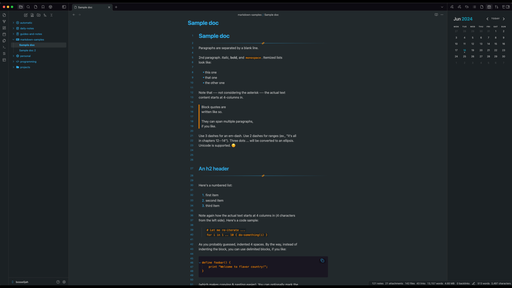
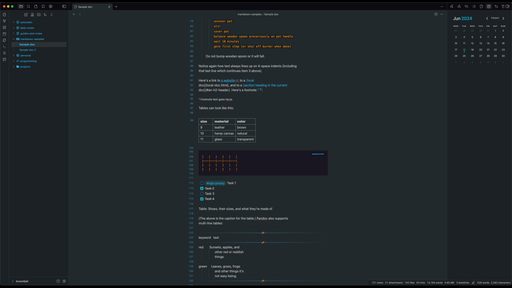

<h1 align="center">Obsidian Dark Theme: Bossidian</h1>

v1.x | Designed & Coded with 💎 by BossElijah  
Modern dark theme for Obsidian.md!

## Development process

- Use the `watch` command defined in `package.json` to turn compile the styling
- Adjust styling in the `sass` directory and see it get live updated in Obsidian